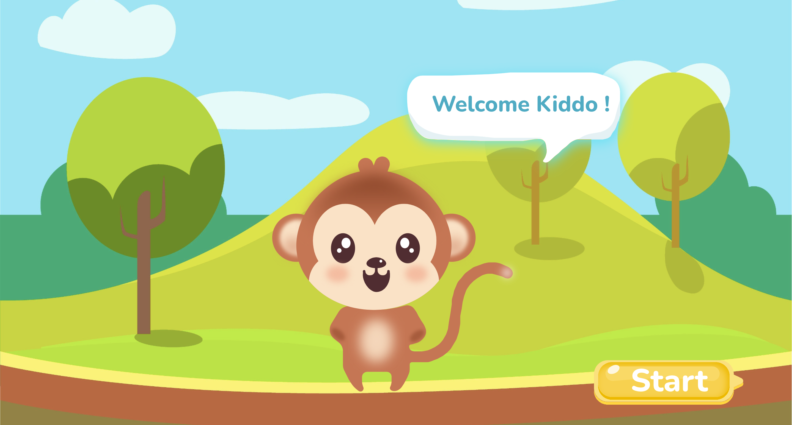
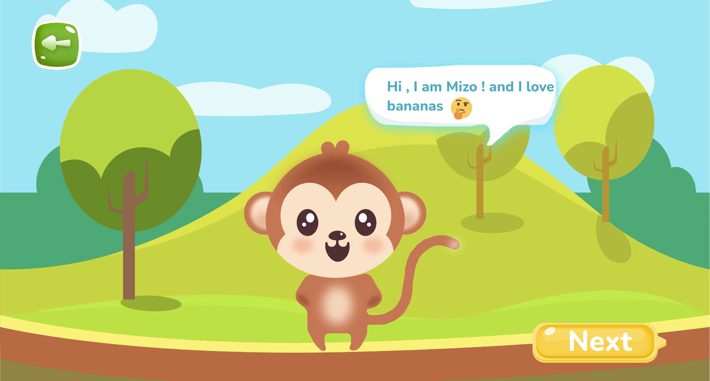
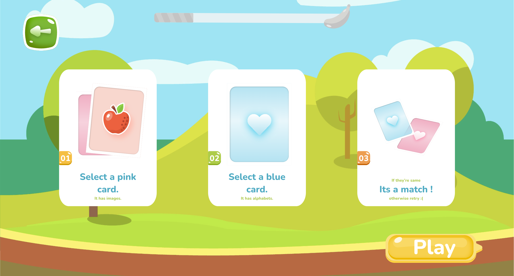
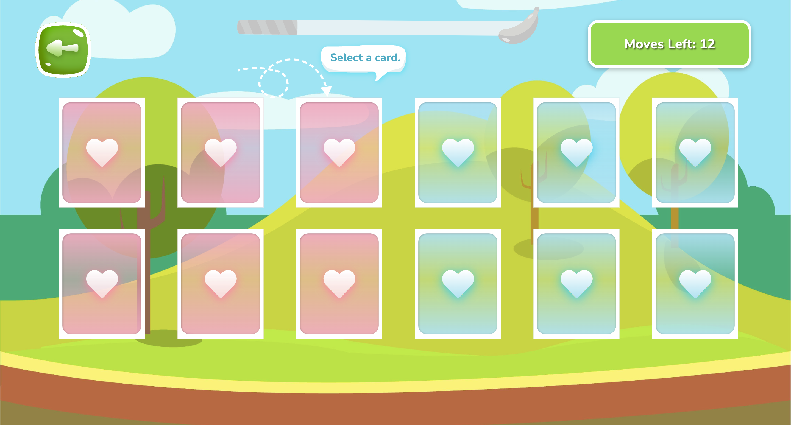
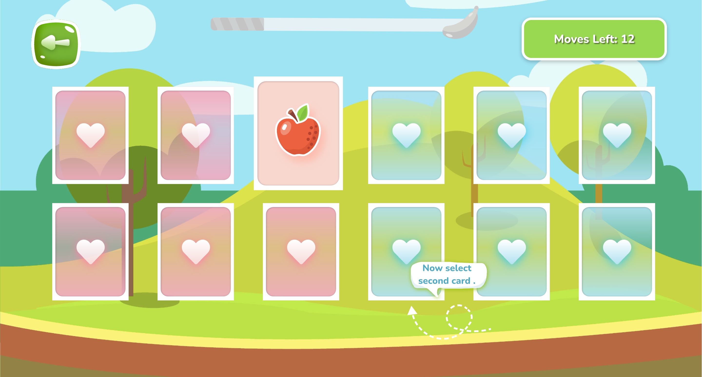
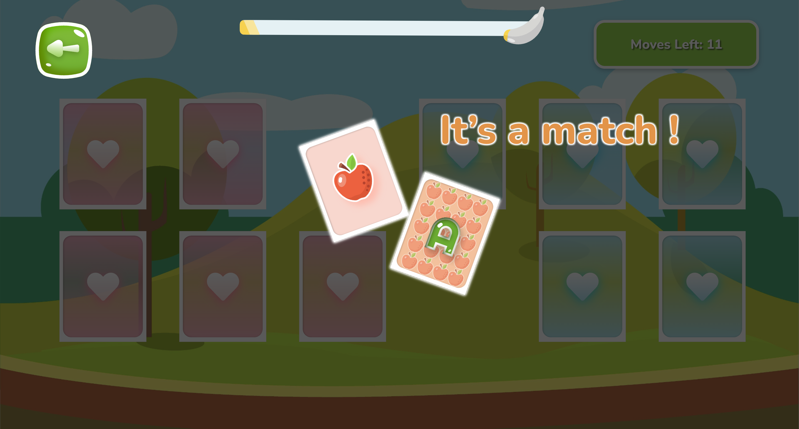
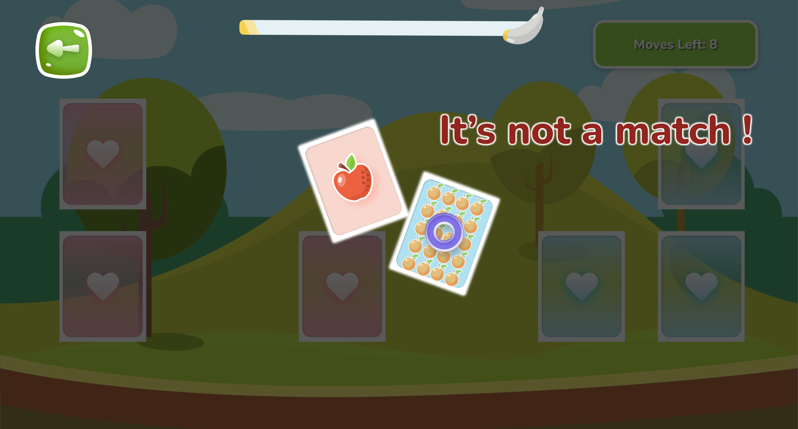
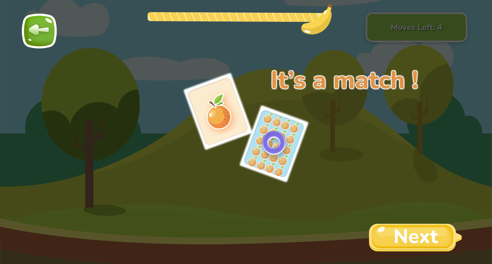
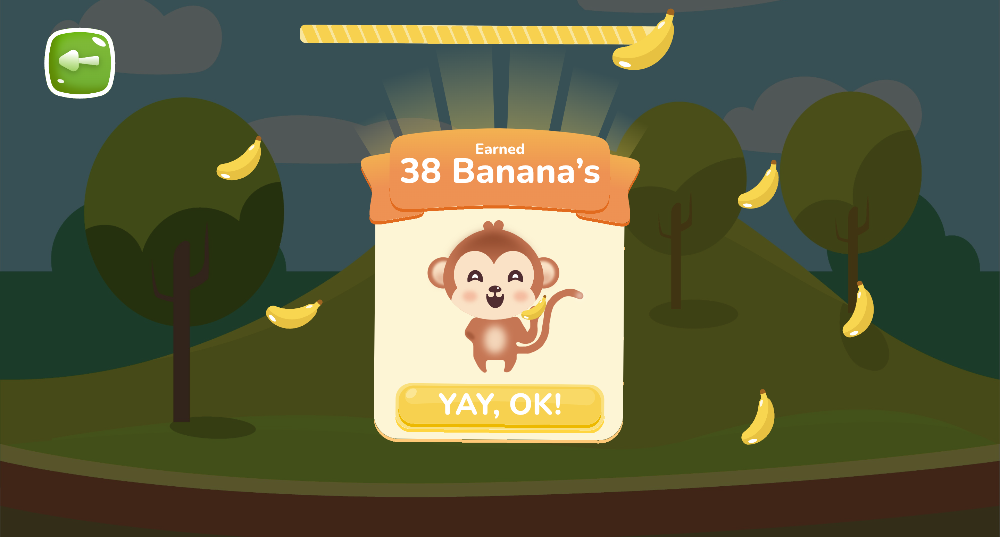

# FruitMemory Challenge

Welcome to FruitMemory Challenge, an exciting and colorful memory match game designed to enhance your cognitive skills through fruity fun! 

## Instructions:

1. **Selecting Cards:**
   - Tap on any fruit card to reveal its image. This is your first selected card.
   - Tap on a second card to reveal its image. This is your second selected card.

2. **Matching Pairs:**
   - If the selected cards match, they will be automatically removed from the board.
   - Successfully match all pairs to win the game.

3. **Unmatched Cards:**
   - If the selected cards do not match, they will flip back, and you'll have another chance to make a pair.
   - Remember the positions of unmatched cards to improve your strategy.

4. **Matching Logic:**
   - For an added challenge, the two remaining cards will display a combination of a fruit image on the left and the first alphabet of the fruit name on the right.
   - You must match the correct pair of cards, considering both the image and the alphabet.

5. **Total Moves:**
   - You have 12 moves to complete the game. Use your memory wisely to match all pairs.

6. **Scoring:**
   - Your score is based on the number of moves taken to complete the game.
   - Aim for a lower score to challenge yourself and improve.

7. **Game Completion:**
   - Successfully match all pairs within 12 moves to complete the game.
   - A congratulatory message will appear, along with your final score.

## Getting Started:

1. Clone the repository: `https://github.com/rohitsingh-23/memory-game.git`
2. Open the project in your preferred code editor.
3. Install dependencies: `npm install`
4. Launch the app: `npm start`

## Technologies Used:

- HTML
- CSS
- ReactJS
- TypeScript

## Deployed App:

Check out the deployed version of FruitMemory Challenge [here](https://memory-game-rohit.vercel.app/).

## Screenshots:

## License:

This project is licensed under the [MIT License](LICENSE).

## Acknowledgements:

- Fruit illustrations by [
